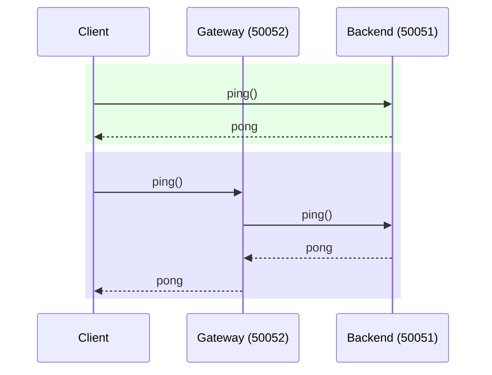

```mermaid
sequenceDiagram
  participant C as Client
  participant G as Gateway (50052)
  participant B as Backend (50051)

  rect rgb(230, 255, 230)
    C->>B: ping()
    B-->>C: pong
  end

  rect rgb(230, 230, 255)
    C->>G: ping()
    G->>B: ping()
    B-->>G: pong
    G-->>C: pong
  end
```