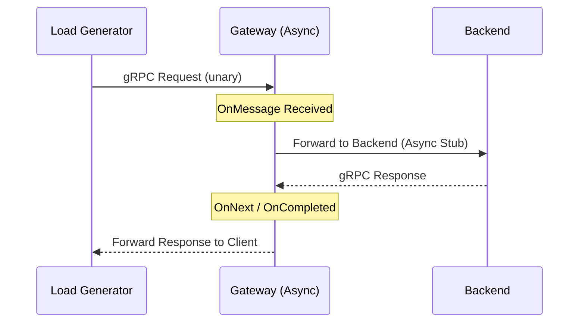

# Request Flow

This page details the journey of a gRPC request through the system.

## Unary Call Path

## Async Forwarding Logic

The Gateway uses `StreamObserver` to proxy requests. Crucially, it does **not** block a thread while waiting for the backend response. Instead:

1. Receive the incoming request.
2. Initiate an asynchronous call to the backend.
3. Register a callback that forwards the result to the original client once available.

This design allows the Gateway to handle thousands of concurrent requests using a small, fixed-size thread pool.